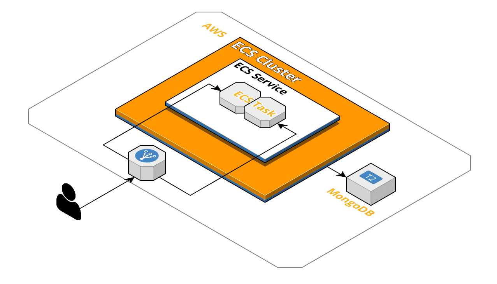
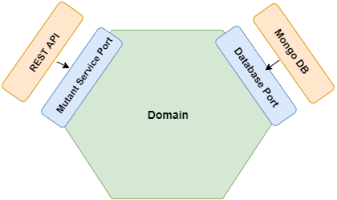
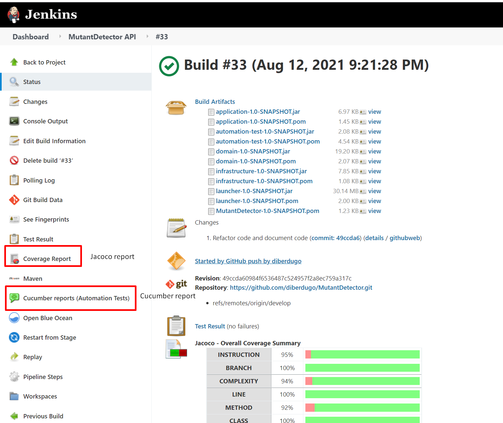
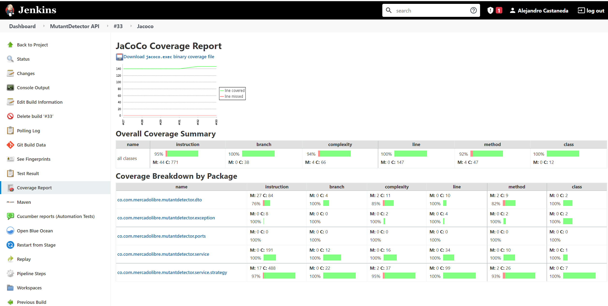
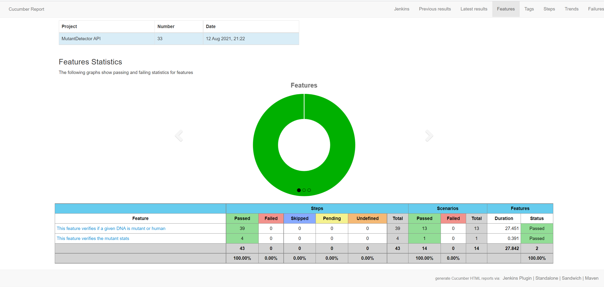
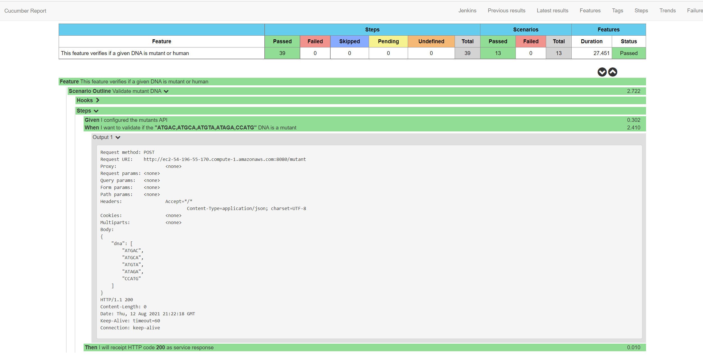

# Mutant Detector

# Tabla de contenido
1. [Infraestructura](#infraestructura)
2. [Arquitectura](#arquitectura)
3. [Propuesta de solución](#propuesta-de-solución)
4. [Pruebas realizadas](#pruebas-realizadas)
5. [Integración continua](#integración-continua)
6. [Ejecución remota](#ejecución-remota)
7. [Ejecución local](#ejecución-local)


## Infraestructura
El ejercicio fue realizado usando la cloud de Amazon, en la cual se crearon diferentes recursos para satisfacer las necesidades del ejercicio, se utilizó un balanceador de carga de aplicaciones, un clúster ECS y varias instancias EC2 para albergar la aplicación y la base de datos. El siguiente diagrama dará a entender la infraestructura planteada.



Dentro del clúster ECS nos encontramos con un servicio que contiene 2 task, cada uno de estas task es una instancia de la aplicación almacenada en un EC2 que será usada por el balanceador de carga; al tener la aplicación en un clúster ECS se le delega a Amazon toda la responsabilidad de la construcción del contenedor y su administración, en este caso el servicio se despliega en el contenedor a través de docker. 

Para soportar 1 millón de peticiones por segundo se requieren recursos con mayor capacidad y crecer de forma horizontal en los picos de peticiones, ECS nos permite crecer fácilmente de forma horizontal pero en la configuración de este ejercicio no fue posible debido a altos costos que se pueden generar, adicionalmente tener más de una base de datos ayudaría al proceso de escalamiento, Dynamodb sería una excelente opción ya que nos permite escalar y sincronizar las diferentes bases de datos.

## Arquitectura
La arquitectura de software que se utilizó para solucionar el ejercicio fue un arquitectura hexagonal, la cual nos permite separar toda nuestra lógica de negocio (dominio) del resto de las funcionalidades, el dominio a su vez expone puertos (interfaces) con firmas de métodos ya establecidas que serán consumidas por diferentes adaptadores; así por ejemplo, nos abstraemos de que el detector de mutantes sea utilizado a través de una API REST, desde una interfaz gráfica o desde una consola y que la información de los mutantes sea almacenada en una base de datos relacional o no relacional. El siguiente diagrama ayudará a explicar un poco más en que consiste esta arquitectura.



Una de las características principales de esta arquitectura es que nuestra lógica de negocio no dependerá de entes externos como por ejemplo; frameworks o base de datos que amarren nuestras funcionalidades a tecnologías que no tienen nada que ver con nuestra lógica.

Para construir la API REST, conexión y manejo de la base de datos se utilizó spring boot y mongodb.

## Propuesta de solución
Para determinar si un DNA pertenecía a un humano o al de un mutante, se hizo uso del patrón strategy el cual nos permite generar varias "estrategias" o algoritmos; estos algoritmos extraen de forma vertical, horizontal y oblicua los datos de la matriz; por ejemplo, el algoritmo encargado de determinar las secuencias verticales realiza lo siguiente:

|||||||
|---|---|---|---|---|---|
| **A** | T | G | C | G | A |
| **C** | A | G | T | G | C |
| **T** | T | A | T | G | T |
| **A** | G | A | A | G | G |
| **C** | C | C | C | T | A |
| **T** | C | A | C | T | G |

En este caso el algoritmo extraerá la información de la matriz de forma vertical, toda la primera columna que está en negrita será enviada a otro algoritmo para contar la cantidad de letras secuenciales que posee, en este ejemplo no contará ninguna y seguirá con la siguiente columna. Miremos otro ejemplo:

|||||||
|---|---|---|---|---|---|
| A | T | G | C | **G** | A |
| C | A | G | T | **G** | C |
| T | T | A | T | **G** | T |
| A | G | A | A | **G** | G |
| C | C | C | C | **T** | A |
| T | C | A | C | **T** | G |

La columna que está en negrita será enviada al algoritmo que contará las letras secuenciales y determinará que esta columna cumple con la condición y retornará el dato correspondiente para tenerlo en cuenta.

Cada forma de terminar si el DNA es de un mutante tiene su propia estrategia para extraer los datos de la matriz y enviarlos al algoritmo que cuenta las letras secuenciales, esto quiere decir que el algoritmo que cuenta las secuencias de letras está totalmente abstraído de la forma en que fueron obtenidos los datos, puesto que esta responsabilidad recae sobre los diferentes algoritmos strategy.

La solución implementada soporta cualquier tipo de matriz siempre y cuando contenga las 4 secuencias y las letras establecidas como regla de negocio en el ejercicio.

## Pruebas realizadas
Se realizaron los siguientes tipos de pruebas:

- Pruebas unitarias (JUnit con mockito)
- Pruebas de integración y funcionales (Cucumber con rest assured)

### Pruebas unitarias
Gracias a la arquitectura hexagonal se pueden realizar pruebas unitarias de forma muy sencilla ya que, nuestro dominio se encuentra totalmente aislado y no depende de ningún tipo de framework o de entes externos, el porcentaje de coverage es de 94%

### Pruebas de integración y funcionales
Para la realización de este tipo de pruebas se utilizó Cucumber (herramienta que permite escribir tests usando BDD) y rest assured que nos permite realizar pruebas sobre servicios.

## Integración continua
La solución que se implementó cuenta con integración continua en jenkins, esto quiere decir que automáticamente después de realizar un merge hacia la rama main automáticamente se construirán los artefactos, se correrán pruebas unitarias, se desplegará en AWS y se ejecutarán las pruebas automatizadas.

En el siguiente link [Jenkins](http://ec2-3-81-1-92.compute-1.amazonaws.com:8080/) se puede ingresar al servidor, el usuario y contraseña para ingresar fueron suministrados en la entrega del ejercicio, una vez allí se podrá visualizar un Job llamado MutantDetector API el cual contiene un reporte de coverage (jacoco) y el reporte de pruebas automatizas (cucumber), estos reportes están dados por cada una de las build.



### Jacoco report


### Cucumber report




## Ejecución remota
La api se encuentra publicada en la siguiente URL:

| Base URL | Path | Método |
|---|---|---|
|http://mutant-detector-lb-1454162446.us-east-1.elb.amazonaws.com/mutant-detector|/stats|GET|
|http://mutant-detector-lb-1454162446.us-east-1.elb.amazonaws.com/mutant-detector|/mutant|POST|

## Ejecución local
Para ejecutar localmente descargue el proyecto de este repositorio y constrúyalo utilizando maven con el siguiente comando:
```sh
mvn --projects !automation-test --also-make clean install
```
Una vez construido, ejecutar la clase llamada **Application.java** ubicada en el modulo **launcher** esta clase levantará un servicio en el localhost con el puerto 80, después de esto ya está listo para realizar peticiones.

Nota: La conexión a la base de datos ya se encuentra configurada por defecto.

Para ejecutar las pruebas automatizas ejecute el siguiente comando maven:
```sh
mvn --projects automation-test --also-make clean install -Duri="http://localhost:80/mutant-detector"
```
El reporte quedará disponible en: **automation-test/target/cucumber-html-reports/overview-features.html**
